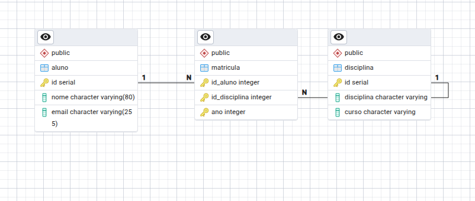

Revisão prática com PostgreSQL

---
## Shell (Psql)

Comandos Básicos:
```sql
CREATE DATABASE revisao; -- Criar banco de dados
\c revisao               -- Conectar no banco
\d                       -- Listar tabelas
```

Criando tabela `aluno` com ID, Nome, Email:
```Sql
CREATE TABLE aluno(   
    id SERIAL PRIMARY KEY,     --Chave Primaria
    nome VARCHAR(80) NOT NULL, 
    email VARCHAR(255) NOT NULL
);
```

Inserindo dados na tabela `Aluno`:
```Sql
INSERT INTO aluno(nome, email) VALUES
('Gabriel Santos', 'gab.santos@gmail.com'),
('Vinicius Rambo', 'vncs.rambo@gmail.com'),
('Manoel', 'Manoel@gmail.com');
```

Para mostrar todos os itens da tabela:
```Sql
SELECT * FROM aluno;   --Mostra todos os itens da tabela alunos
```

Os comandos do `psql` são mais usados por administradores para gerenciamento via terminal.
Para desenvolvimento, é mais comum utilizar ferramentas gráficas. Em aula, será utilizado o **pgAdmin 4**.

---
## PgAdmin

O PgAdmin é uma interface gráfica de manipulação de bancos de dado Postgres, porém vou adicionar os códigos SQL gerados usando ele.

---
Criando a tabela `disciplina`:
```sql
CREATE TABLE public.disciplina(
    id SERIAL NOT NULL,
    nome VARCHAR(80) NOT NULL,
    curso VARCHAR(20) NOT NULL,
    PRIMARY KEY (id)
);
```

inserindo dados em `disciplina`: 
```sql
INSERT INTO disciplina(nome, curso) VALUES
('Redes', 'TADS'),
('Estrutura de dados', 'ADS'),
('Banco de Dados', 'TADS');
```

Criando tabela `matricula`:
```sql
CREATE TABLE public.matricula(
    id_aluno INTEGER NOT NULL,
    id_disciplina INTEGER NOT NULL,
    ano INTEGER NOT NULL,
    PRIMARY KEY (id_aluno, id_disciplina, ano),

    FOREIGN KEY (id_aluno)
        REFERENCES public.aluno (id)
        ON UPDATE NO ACTION
        ON DELETE NO ACTION,

    FOREIGN KEY (id_disciplina)
        REFERENCES public.disciplina (id)
        ON UPDATE NO ACTION
        ON DELETE NO ACTION
);
```

Imagem referente a forma das tabelas Aluno - Matricula - Disciplinas


Inserindo dados em `matricula`:
```Sql
INSERT INTO matricula(id_aluno, id_disciplina, ano) VALUES
(1001, 2, 2026),
(1001, 1, 2026);
```

Testes de integridade: 
```sql
INSERT INTO matricula(id_aluno, id_disciplina, ano) VALUES
(1005, 1, 2026),        --Aluno não existe
(1, 10, 2026),          --Disciplina não existe
(1, 1, 20266);          --Banco aceita se não houver restrições
```
---
###### Tratamento de Dados (Restrições)
adicionando validações para o campo `ano`:
```sql
ALTER TABLE IF EXISTS public.matricula
    ADD CHECK (ano > 2025);
```

```sql
ALTER TABLE IF EXISTS public.matricula
    ADD CHECK (ano < 2030);
```
